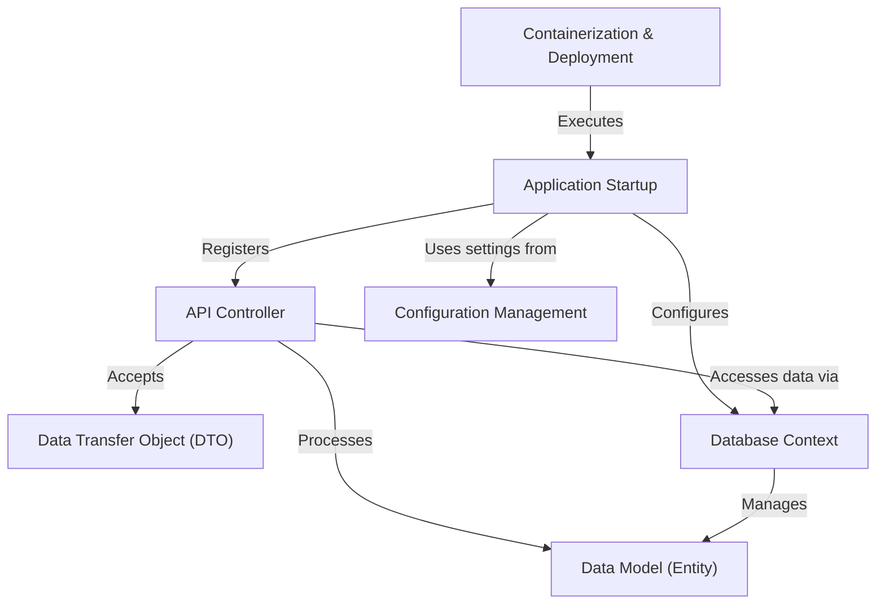

# Tutorial: ContactAPI-P

This project, `ContactAPI-P`, is an *API* (Application Programming Interface) designed to *manage contact information*. It acts like a digital address book, allowing other applications to easily **create new contacts**, **retrieve lists of contacts**, and even **delete existing ones**. Essentially, it provides a structured way for programs to interact with and handle your contact data, making it easy to integrate contact management into other services.

## Visual Overview

## Chapters

1. [Data Transfer Object (DTO)
](01_data_transfer_object__dto__.md)
2. [API Controller
](02_api_controller_.md)
3. [Data Model (Entity)
](03_data_model__entity__.md)
4. [Database Context
](04_database_context_.md)
5. [Application Startup
](05_application_startup_.md)
6. [Configuration Management
](06_configuration_management_.md)
7. [Containerization & Deployment
](07_containerization___deployment_.md)

---

Generated by [AI Codebase Knowledge Builder](https://github.com/The-Pocket/Tutorial-Codebase-Knowledge).
